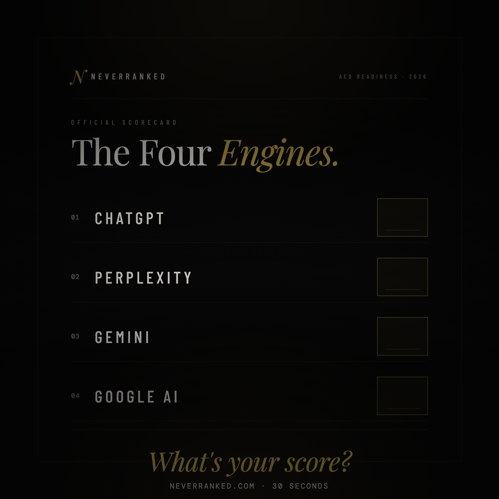

# NeverRanked LinkedIn Kit

Everything you need to launch and run the NeverRanked LinkedIn presence. Open any `.md` file in a markdown viewer (GitHub, VS Code, Obsidian) to see image + caption together.

---

## Company Page

| File | What it is |
|---|---|
| [company-page.md](company-page.md) | Setup fields, About section (1,487 chars), 20 specialty tags, 5 seed posts for the company account |
| [logo-300.png](logo-300.png) | 300×300 company logo |
| [cover-1128x191.png](cover-1128x191.png) | 1128×191 cover image |
| [assets-spec.md](assets-spec.md) | Sizing, upload order, regen instructions |

**Launch order:** claim the page at linkedin.com/company/setup/new → upload logo → upload cover → paste tagline → paste About → add specialties → post seed post 1.

---

## Personal Profile — Image Posts

Each file pairs one image with its caption and posting notes in a single view.

| Post | Preview | Hook | Use when |
|---|---|---|---|
| [post-01.md](post-01.md) |  | Fear — "your competitors are in ChatGPT's answer, you're not" | Launch moment, cold reach |
| [post-02.md](post-02.md) |  | Curiosity — "when did you last check?" | Week 2-3, evergreen re-post |

---

## Personal Profile — Text-Only Posts

| File | What it is |
|---|---|
| [personal-posts.md](personal-posts.md) | 10 educational AEO posts (stat-led, myth-bust, tactical, teardown, contrarian, etc.). Each ends with a soft CTA to the free audit. Cadence: 3/week for 3 weeks. |

---

## Sources & Tooling

| File | Purpose |
|---|---|
| `logo-source.html` | HTML source for the logo PNG |
| `cover-source.html` | HTML source for the cover PNG |
| `post-01-scorecard-source.html` | HTML source for Post 01 image |
| `post-02-truthcard-source.html` | HTML source for Post 02 image |
| `render.mjs` | Playwright renderer. Regenerate all PNGs with `node linkedin/render.mjs` |

---

## Adding a new image post

1. Create `post-NN-<name>-source.html` (copy the structure of an existing source file).
2. Add the target to the `targets` array in `render.mjs`.
3. Run `node linkedin/render.mjs` from the repo root.
4. Create `post-NN.md` paired with the new image, following the structure of `post-01.md` / `post-02.md`.
5. Add a row to the "Personal Profile — Image Posts" table above.
