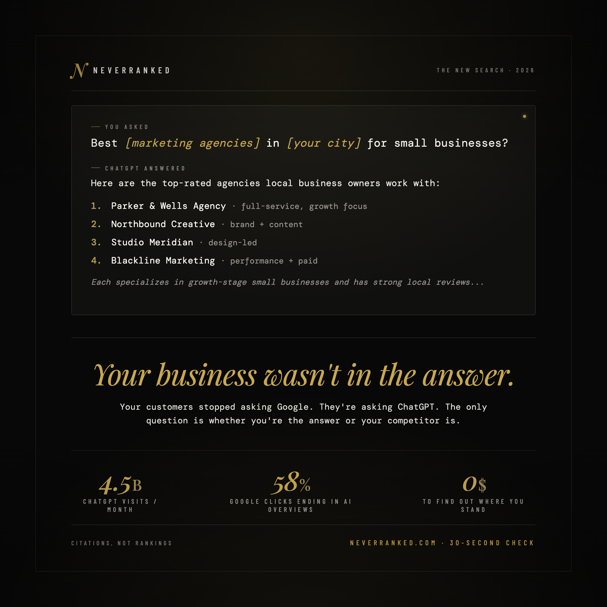

# NeverRanked LinkedIn Kit

Everything you need to launch and run the NeverRanked LinkedIn presence.

- **`images/`** — all PNGs ready to upload to LinkedIn
- **`captions/`** — all post copy as plain `.txt` files (easy copy-paste)
- **`*.md`** — setup docs, posting notes, and creative rationale

---

## Company Page

| File | What it is |
|---|---|
| [company-page.md](company-page.md) | Setup fields, About section (1,487 chars), 20 specialty tags, seed post index |
| [images/logo-300.png](images/logo-300.png) | 300×300 company logo |
| [images/cover-1128x191.png](images/cover-1128x191.png) | 1128×191 cover image |
| [assets-spec.md](assets-spec.md) | Sizing, upload order, regen instructions |

**Company seed captions** (5 posts) — [captions/company-01-manifesto.txt](captions/company-01-manifesto.txt) · [company-02-stat.txt](captions/company-02-stat.txt) · [company-03-proof.txt](captions/company-03-proof.txt) · [company-04-audit.txt](captions/company-04-audit.txt) · [company-05-anti-agency.txt](captions/company-05-anti-agency.txt)

**Launch order:** claim the page at linkedin.com/company/setup/new → upload logo → upload cover → paste tagline → paste About → add specialties → post seed post 1.

---

## Personal Profile — Image Posts

| Post | Preview | Image | Caption | Notes |
|---|---|---|---|---|
| Post 01 |  | [images/post-01-scorecard.png](images/post-01-scorecard.png) | [captions/post-01-chatgpt-mock.txt](captions/post-01-chatgpt-mock.txt) | [post-01.md](post-01.md) |
| Post 02 |  | [images/post-02-truthcard.png](images/post-02-truthcard.png) | [captions/post-02-truth-card.txt](captions/post-02-truth-card.txt) | [post-02.md](post-02.md) |

---

## Personal Profile — Text-Only Posts

10 educational AEO posts for Lance's personal feed. Each ends with a soft CTA to the free audit. Cadence: 3/week for 3 weeks. Overview and rationale in [personal-posts.md](personal-posts.md).

| # | Lever | File |
|---|---|---|
| 01 | Stat-led | [captions/personal-01-stat-led.txt](captions/personal-01-stat-led.txt) |
| 02 | Myth-bust | [captions/personal-02-myth-bust.txt](captions/personal-02-myth-bust.txt) |
| 03 | Tactical | [captions/personal-03-tactical.txt](captions/personal-03-tactical.txt) |
| 04 | Teardown | [captions/personal-04-teardown.txt](captions/personal-04-teardown.txt) |
| 05 | Contrarian | [captions/personal-05-contrarian.txt](captions/personal-05-contrarian.txt) |
| 06 | Montaic case | [captions/personal-06-montaic.txt](captions/personal-06-montaic.txt) |
| 07 | Confession | [captions/personal-07-confession.txt](captions/personal-07-confession.txt) |
| 08 | Four engines | [captions/personal-08-four-engines.txt](captions/personal-08-four-engines.txt) |
| 09 | Reframe | [captions/personal-09-reframe.txt](captions/personal-09-reframe.txt) |
| 10 | Soft sell | [captions/personal-10-soft-sell.txt](captions/personal-10-soft-sell.txt) |

---

## Sources & Tooling

| File | Purpose |
|---|---|
| `logo-source.html` | HTML source for the logo PNG |
| `cover-source.html` | HTML source for the cover PNG |
| `post-01-scorecard-source.html` | HTML source for Post 01 image |
| `post-02-truthcard-source.html` | HTML source for Post 02 image |
| `render.mjs` | Playwright renderer. Regenerate all PNGs with `node linkedin/render.mjs` |

---

## Adding a new image post

1. Create `post-NN-<name>-source.html` (copy the structure of an existing source file).
2. Add the target to the `targets` array in `render.mjs` (output path `images/post-NN-<name>.png`).
3. Run `node linkedin/render.mjs` from the repo root.
4. Create `captions/post-NN-<name>.txt` with the caption.
5. Create `post-NN.md` with posting notes pointing to the image and caption files.
6. Add a row to the "Personal Profile — Image Posts" table above.
